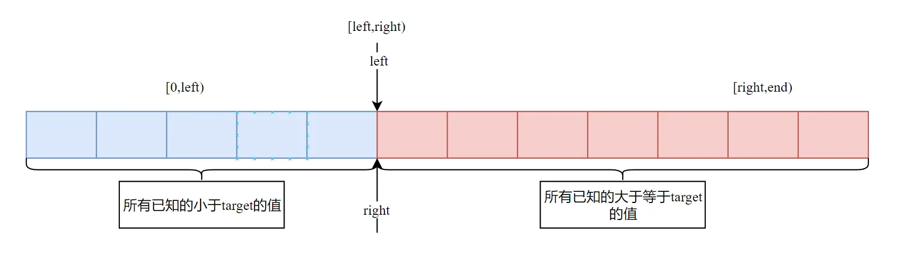

# Array

## 排序算法

### 冒泡排序

冒泡排序是一种简单的排序算法，它重复地遍历要排序的数列，一次比较两个元素，如果它们的顺序错误就把它们交换过来。遍历数列的工作是重复地进行直到没有再需要交换，也就是说该数列已经排序完成。这个算法的名字由来是因为越小的元素会经由交换慢慢“浮”到数列的顶端。

```cpp
#include <iostream>
#include <vector>
using namespace std;
void sort(vector<int>& arr) {
    int size = arr.size();
    bool swap = true;

    while(swap) {
        for (int i = 1; i < size; ++i) {
            swap = false;
            if (arr[i - 1] > arr[i]) {
                swap = true;
                int temp = arr[i - 1];
                arr[i - 1] = arr[i];
                arr[i] = temp;
            }
        }
    }
}

int main() {
    vector<int> arr = {5, 2, 4, 6, 1, 3};
    sort(arr);
    for (int i = 0; i < arr.size(); ++i) {
        cout << arr[i] << " ";
    }
    cout << endl;
    return 0;
}
```

### 选择排序

选择排序是一种简单直观的排序算法，它的工作原理是每一次从待排序的数据元素中选出最小（或最大）的一个元素，存放在序列的起始位置，直到全部待排序的数据元素排完。选择排序是不稳定的排序方法。不稳定的排序算法是指那些可能会改变相同元素的相对顺序的排序算法。

```cpp
#include <iostream>
#include <vector>
using namespace std;

void sort(vector<int>& arr) {
    int n = arr.size();
    for (int i = 0; i < n - 1; ++i) {
        int min_idx = i;
        for (int j = i + 1; j < n; ++j) {
            if (arr[j] < arr[min_idx]) {
                min_idx = j;
            }
        }
        swap(arr[i], arr[min_idx]);
    }
}
```

### 插入排序

插入排序是一种简单直观的排序算法，它的工作原理是通过构建有序序列，对于未排序数据，在已排序序列中从后向前扫描，找到相应位置并插入。插入排序在实现上，通常采用 in-place 排序（即只需用到 O(1)的额外空间的排序），因而在从后向前扫描过程中，需要反复把已排序元素逐步向后挪位，为最新元素提供插入位置。

```cpp
#include <iostream>
#include <vector>
using namespace std;
void sort(vector<int>& arr) {
    int n = arr.size();
    for (int i = 1; i < n; ++i) {
        int cur = arr[i];
        int idx = i;
        for (int j = i-1; j >= 0; --j) {
            if (arr[j] > cur) {
                idx = j;
                arr[j+1] = arr[j];
            }
        }
        arr[idx] = cur;
    }
}
```

### 归并排序

归并排序是一种分治算法。其思想是将待排序的数组分成两个子数组，分别对两个子数组进行排序，然后将两个有序的子数组合并成一个有序的数组。归并排序的时间复杂度为 O(nlogn)，空间复杂度为 O(n)。

```cpp
#include <iostream>
#include <vector>
using namespace std;

void merge(vector<int>& arr, int left, int mid, int right) {
    int n1 = mid - left + 1;
    int n2 = right - mid;
    vector<int> L(n1);
    vector<int> R(n2);
    for (int i = 0; i < n1; ++i) {
        L[i] = arr[left + i];
    }
    for (int i = 0; i < n2; ++i) {
        R[i] = arr[mid + i + 1];
    }
    int i = 0, j = 0, k = left;
    while (i < n1 && j < n2) {
        if (L[i] <= R[j]) {
            arr[k] = L[i];
            i++;
        } else {
            arr[k] = R[j];
            j++;
        }
        k++;
    }
    while (i < n1) {
        arr[k] = L[i];
        i++;
        k++;
    }
    while (j < n2) {
        arr[k] = R[j];
        j++;
        k++;
    }
}
void mergeSort(vector<int>& arr, int left, int right) {
    if (left < right) {
        int mid = left + (right - left) / 2;
        mergeSort(arr, left, mid);
        mergeSort(arr, mid + 1, right);
        merge(arr, left, mid, right);
    }
}
int main() {
    vector<int> arr = {5, 2, 4, 6, 1, 3};
    mergeSort(arr, 0, arr.size() - 1);
    for (int i = 0; i < arr.size(); ++i) {
        cout << arr[i] << " ";
    }
    cout << endl;
    return 0;
}
```

### 快速排序

快速排序是一种分治算法。其思想是选择一个基准元素，将数组分成两个子数组，其中一个子数组的所有元素都小于基准元素，另一个子数组的所有元素都大于基准元素。然后对这两个子数组分别进行快速排序，最后将两个有序的子数组合并成一个有序的数组。快速排序的时间复杂度为 O(nlogn)，空间复杂度为 O(logn)

```cpp
#include <iostream>
#include <vector>
using namespace std;
int partition(vector<int>& arr, int left, int right) {
    int pivot = arr[right];
    int i = left - 1;
    for (int j = left; j < right; ++j) {
        if (arr[j] <= pivot) {
            i++;
            swap(arr[i], arr[j]);
        }
    }
    swap(arr[i + 1], arr[right]);
    return i + 1;
}
void quickSort(vector<int>& arr, int left, int right) {
    if (left < right) {
        int pivot = partition(arr, left, right);
        quickSort(arr, left, pivot - 1);
        quickSort(arr, pivot + 1, right);
    }
}
int main() {
    vector<int> arr = {5, 2, 4, 6, 1, 3};
    quickSort(arr, 0, arr.size() - 1);
    for (int i = 0; i < arr.size(); ++i) {
        cout << arr[i] << " ";
    }
    cout << endl;
    return 0;
}
```

### 对比

| 排序算法 | 时间复杂度 | 空间复杂度 | 稳定性 |
| -------- | ---------- | ---------- | ------ |
| 冒泡排序 | O(n^2)     | O(1)       | 稳定   |
| 选择排序 | O(n^2)     | O(1)       | 不稳定 |
| 插入排序 | O(n^2)     | O(1)       | 稳定   |
| 归并排序 | O(nlogn)   | O(n)       | 稳定   |
| 快速排序 | O(nlogn)   | O(logn)    | 不稳定 |

## 二分查找

对于有序数组，相较于线性扫描，二分查找可以将复杂度控制在 O(lgn),是一种减而治之的策略，每次将问题的规模缩减一半。但在使用二分法解决问题时，时常会碰到边界条件不明确的问题，下面以三个典型的问题来解释平凡的二分法，并举几个扩展的例子来说明二分法使用的场景。

### 精确查找

下面代码不证自明：

```cpp
int binary_search(const vector<int>& v,int target) {
    int left = 0;
    int right = v.size()-1;
    while(left<=right) {
        int mid = left+(right - left)/2;
        if(v[mid]>target) {
            right = mid - 1;
        } else if(v[mid]<target) {
            left = mid+1;
        } else {
            return mid;
        }
    }
    return -1;
}
```

### 边界查找
- 有序序列中寻找一个数的左边界
> 左边界是指第一个大于等于给定 target 值的秩。
```cpp
int binary*search(const vector<int>& v,int target) {
    int left = 0;
    int right = v.size();// 左闭右开
        while(left<right) {
            int mid = left+(right - left)/2;
            if(v[mid]>=target) {
                right = mid ; // 左边界，则所有大于等于 target 的都应该在右边
            } else {
                left = mid+1;
            }
    }
    return left;
}
```

正确性证明：
在循环过程中始终有如下不变性：
初始时：

过程中：

循环终止时：

可以看出，跳出循环时必有 left == right 且，left 是第一个低于等于 target 的下标 

- 有序序列中寻找一个数的右边界

> 右边界是指第一个大于给定 target 值的秩。

```cpp
int binary_search(const vector<int>& v,int target) {
    int left = 0;
    int right = v.size();
    while(left<right) {
        int mid = left+(right - left)/2;
        if(v[mid]>target) {
            right = mid ;
        } else {
            left = mid+1;
        }
    }
    return left;
}
```

证明同上。

## 相关算法
### 双指针

### 滑动窗口